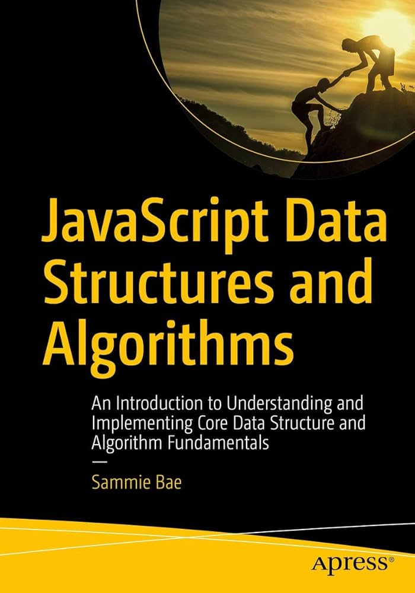

## **Learning sources:**

1. [Data Structures and Algorithms with Javascript - Codecademy](https://www.codecademy.com/learn/paths/pass-the-technical-interview-with-javascript)

2. [JavaScript Data Structures and Algorithms by Sammie Bae](https://www.google.fi/books/edition/JavaScript_Data_Structures_and_Algorithm/K_aEDwAAQBAJ?hl=vi&gbpv=0)

